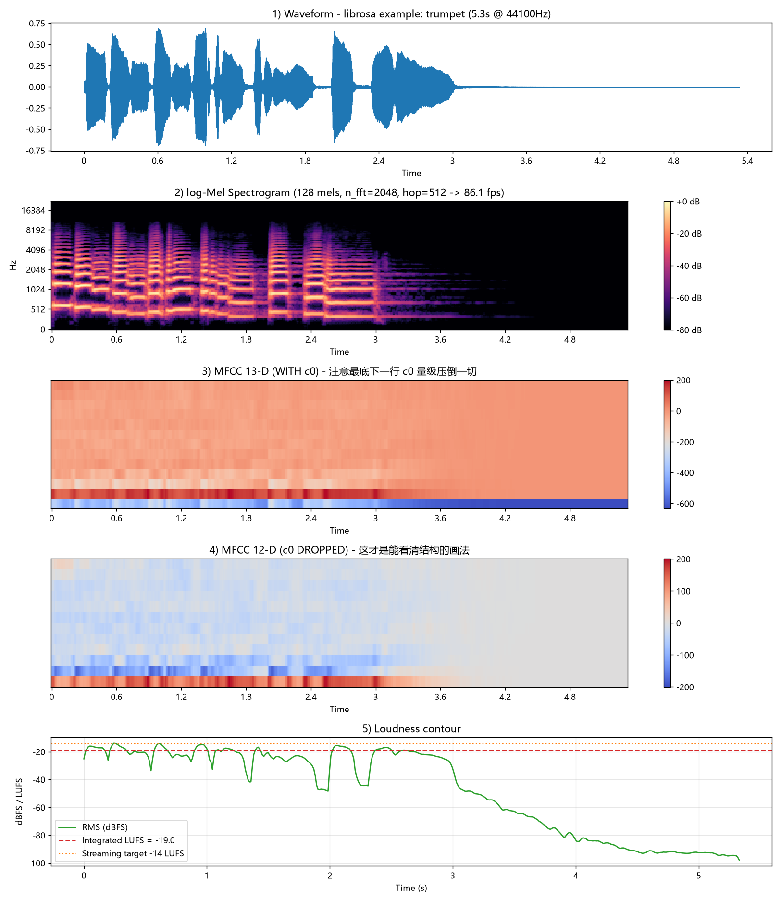

# audio-aigc-lab

> 音频信号分析、特征工程与音频生成 / 编辑复现实践。
> 作者：伍浩然（[@StreakyRan](https://github.com/StreakyRan)）

本仓库记录我在音频 AIGC 方向上的动手实践：**音频特征提取链路**、**音频数据清洗流水线**、**音乐生成与源分离复现**。
每个实验都附**实际运行日志与实测数字**（帧率、矩阵形状、显存、耗时），所有结论均可复现。

---

## 目录结构

```
audio-aigc-lab/
├── README.md
├── requirements.txt
├── 01_audio_analysis/          # 音频信号分析与特征提取
│   ├── h1_audio_analysis.py
│   └── results/
│       ├── h1_audio_analysis.png
│       ├── h1_mfcc39.npy
│       └── h1_run_log.txt
├── 02_data_pipeline/           # 音频数据清洗与打标流水线（待补）
│   └── audio_clean.py
└── 03_music_gen_edit/          # 音乐生成与源分离复现（待补）
    ├── musicgen_infer.py
    └── demucs_separate.py
```

---

## 环境

```bash
pip install -r requirements.txt
```

`requirements.txt`：

```
librosa>=0.10
soundfile>=0.12
numpy>=1.24
matplotlib>=3.7
pyloudnorm>=0.1.1
```

> 说明：`01_audio_analysis` 仅依赖上述 CPU 库。`03_music_gen_edit` 需要额外安装 `torch` / `transformers` / `demucs`。

---

## 01 音频信号分析与特征提取

**目标**：在真实音频上打通完整特征提取链路，并量化各参数的实际影响。

**流程**：

```
波形 → STFT(n_fft=2048, hop=512) → 128 维 log-Mel → 13 维 MFCC(+Δ+ΔΔ=39 维)
```

**运行**：

```bash
cd 01_audio_analysis
python h1_audio_analysis.py "your_audio.wav"
# 不给参数则使用 librosa 自带示例音频
```

**实测结果**（librosa 示例音频，5.33 s @ 44.1 kHz）：

| 项 | 数值 |
|---|---|
| 采样点数 | 235,202 |
| STFT 矩阵形状 | **(1025, 460)** |
| 频率 bins | 1025（= n_fft/2 + 1） |
| 帧率 | **86.13 fps**（= 44100 / 512） |
| 频率分辨率 | **21.53 Hz**（= 44100 / 2048） |
| 时间分辨率 | **46.44 ms**（= 2048 / 44100） |
| log-Mel 形状 | (128, 460) |
| MFCC 静态系数 | (13, 460) |
| MFCC + Δ + ΔΔ | **(39, 460)** |
| c0 数值范围 | −633.6 ~ −227.9 |
| c1~c12 数值范围 | −180.2 ~ 201.2 |
| **c0 与其他系数量级差** | **约 18.5 倍** |
| Integrated LUFS | **−19.03 LUFS**（ITU-R BS.1770，pyloudnorm） |

**关键观察**：

1. **帧率与矩阵形状的对应关系**：`时长 × 帧率 ≈ 帧数`（5.33 × 86.13 = 459.4 ≈ 460），
   说明 STFT 的帧数由 `hop_length` 唯一决定，与 `n_fft` 无关。
2. **c0 必须丢弃**：第 0 维 DCT 系数代表频谱总能量，量级比其他系数大 **18.5 倍**，
   直接可视化会完全掩盖有效特征。这验证了 MFCC 处理中"丢弃 c0 或将其替换为 log 能量"的惯例。
3. **响度测量**：音频的集成响度为 **−19.03 LUFS**，低于流媒体常见的约 −14 LUFS 目标，
   说明素材保留了较多动态余量——这也是音频数据送入训练前需要做 LUFS 归一化的直接原因。

**产出图**（5 联图）：



自下而上依次为：波形 → log-Mel 谱 → MFCC 13 维（含 c0）→ MFCC 12 维（丢 c0）→ 响度曲线 + LUFS 参考线。

---

## 02 音频数据清洗与打标流水线

> 状态：**待补**

计划实现：

- 采样率与声道统一（带抗混叠重采样，禁止直接抽点）
- 静音切除、削波检测、直流偏移去除
- 响度（LUFS / EBU R128）归一化
- CLAP / PANNs 自动打标 + 置信度过滤
- 输出 `manifest.jsonl`（路径、时长、采样率、LUFS、标签、来源、许可）与统计报告

---

## 03 音乐生成与源分离复现

> 状态：**待补**

计划实现：

- MusicGen-small 文本到音乐推理，记录采样耗时与显存峰值
- Demucs v4 音乐源分离（vocals / drums / bass / other）与 stem 级编辑
- FAD / CLAP score 客观评估 + 人工听测记录

---

## 说明与边界

- 本仓库内容为**学习复现与工程实践**，不是原创研究成果，不宣称任何模型或方法的归属。
- 所有引用的模型（MusicGen / Demucs / EnCodec / DAC 等）版权归原作者所有，此处仅用于学习与评估。
- 所有实测数字均来自本机运行日志，脚本可复现。

---

## 参考

- MusicGen: *Simple and Controllable Music Generation* (arXiv:2306.05284)
- Demucs v4 / HT Demucs: *Hybrid Transformers for Music Source Separation* (arXiv:2211.08553)
- EnCodec: *High Fidelity Neural Audio Compression* (arXiv:2210.13438)
- Stable Audio Open: *Stable Audio Open* (arXiv:2407.14358)
